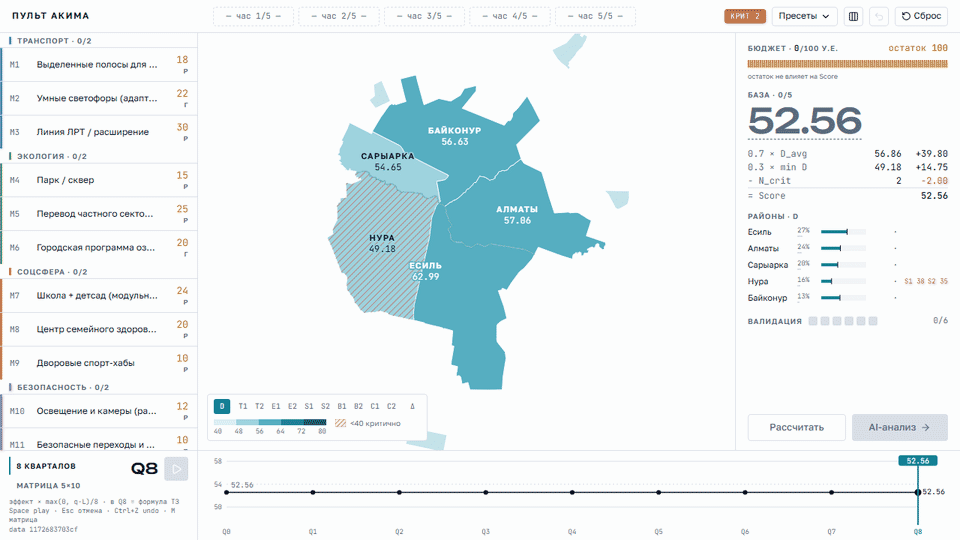
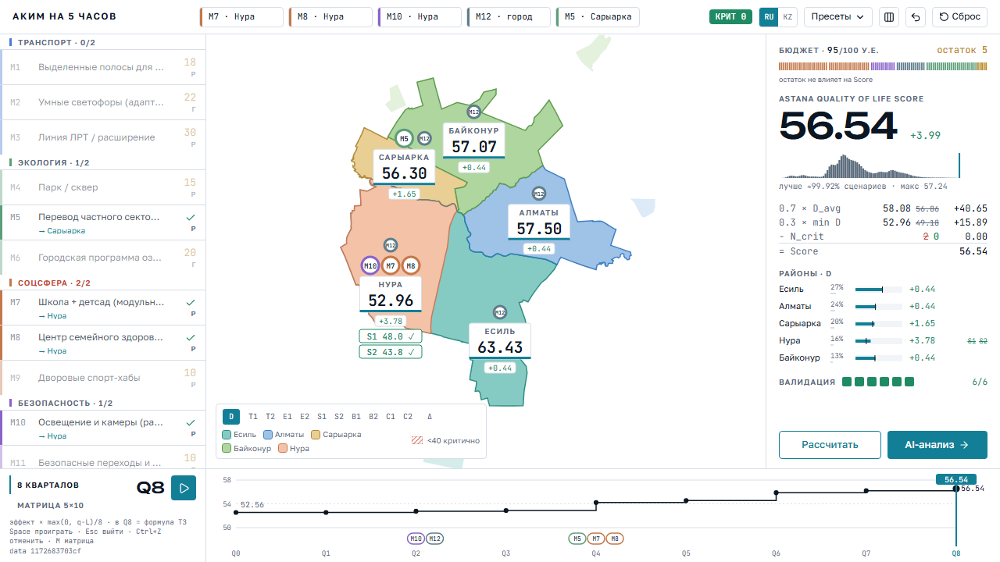
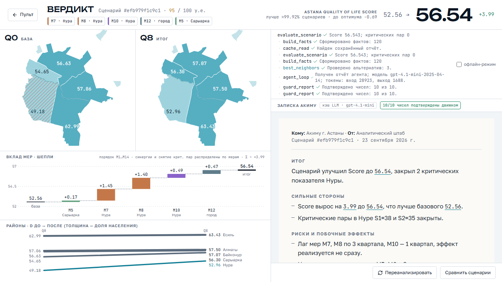
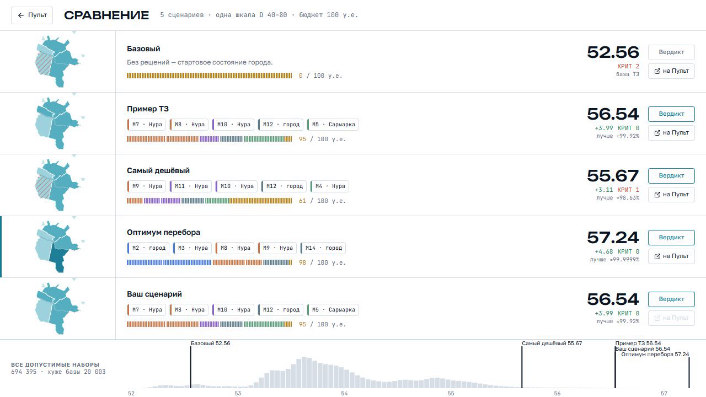

# Аким на 5 часов

AI-симулятор бюджетных решений по районам Астаны. Хакатон, спец-трек Astana Innovations, кейс «Аким на 5 часов», команда lowtap. Сдача: тег `v1.0.5`.

Пользователь получает 100 у.е., пять реальных районов Астаны на карте и каталог из 14 мер по пяти направлениям. Он принимает ровно пять решений, а приложение считает Astana Quality of Life Score по формуле ТЗ, показывает влияние на 50 показателей и пишет аналитическую записку с сильными сторонами, рисками, последствиями и рекомендациями.

Ключевая идея: движок считает, LLM объясняет, числа проверяются. Score, вклады мер и альтернативы вычисляет детерминированный движок; языковая модель получает только таблицу фактов, ссылается на них и советует; каждое десятичное число в её записке сверяется с движком, каждая рекомендация пересчитывается сервером. Без API-ключа и без сети приложение работает полностью.



| Пульт | Вердикт | Сравнение |
|---|---|---|
|  |  |  |

## Быстрый старт

Ключ OpenAI не обязателен: без него для пяти пресетов сервер отдаёт сохранённые ответы агента, для остальных наборов строит записку по правилам на тех же числах.

### Вариант 1. Docker

Нужен Docker с Compose. PowerShell:

```powershell
if (-not (Test-Path .env)) { Copy-Item .env.example .env }
docker compose up --build -d --wait
```

bash:

```bash
test -f .env || cp .env.example .env
docker compose up --build -d --wait
```

Интерфейс: http://localhost:8000, Swagger: http://localhost:8000/docs. Образ собирает фронт на `node:24-alpine` и запускает FastAPI на `python:3.14-slim`. Остановка: `docker compose down`. Если порт 8000 занят, задайте другой перед запуском: `$env:APP_PORT='8010'` в PowerShell или `APP_PORT=8010` в bash. HTTP-проверка собранного контейнера: `py -3 scripts/container_smoke.py` (bash: `python3 scripts/container_smoke.py`); при другом порте добавьте `--base-url http://127.0.0.1:8010`.

### Вариант 2. Локально, одно приложение на порту 8000

FastAPI отдаёт собранный фронт. Нужны Python 3.14 (проверено на CPython 3.14.7, его же используют Docker и CI) и Node.js 20 или новее (проверено на 24). Команды выполняются из корня клона, активация venv не нужна.

PowerShell:

```powershell
$env:PYTHONUTF8='1'
py -3 -m venv .venv
.\.venv\Scripts\python.exe -m pip install -r backend\requirements.txt
cd web; npm ci; npm run build; cd ..
cd backend; ..\.venv\Scripts\python.exe -m uvicorn app.main:app --port 8000
```

bash:

```bash
export PYTHONUTF8=1
python3 -m venv .venv
.venv/bin/python -m pip install -r backend/requirements.txt
(cd web && npm ci && npm run build)
cd backend && ../.venv/bin/python -m uvicorn app.main:app --port 8000
```

Интерфейс: http://localhost:8000, Swagger: http://localhost:8000/docs. Сервер слушает 127.0.0.1; если `localhost` на Windows отвечает медленно из скриптов, обращайтесь к http://127.0.0.1:8000.

### Вариант 3. Только фронт, без Python

```bash
cd web
npm ci
npm run dev
```

Откройте http://localhost:5173. Бэкенд не нужен: TypeScript-движок в браузере зеркалит Python-движок (паритет проверяется тестом на `data/golden.json`), записка строится по шаблону на числах движка, в шапке горит бейдж «офлайн». Если на порту 8000 запущен uvicorn, dev-сервер проксирует `/api`, и приложение само переключается на сервер.

### Ключ OpenAI (необязательно)

```powershell
Copy-Item .env.example .env
```

```bash
cp .env.example .env
```

Заполните `OPENAI_API_KEY` и `OPENAI_MODEL` (id модели из `GET /v1/models` вашего ключа). Цепочка провайдеров при значении по умолчанию `AI_CACHE=first`: cache, затем llm, затем rules; ответ всегда HTTP 200. Числа одинаковы с ключом и без: LLM их не считает. Все переменные окружения и режимы кэша описаны в [docs/ARCHITECTURE.md](docs/ARCHITECTURE.md#настройки).

## Проверка за 5 минут

Команды PowerShell из корня клона; в bash замените `.\.venv\Scripts\python.exe` на `.venv/bin/python`.

| Команда | Ожидаемый результат |
|---|---|
| `cd web; npm test` | **143 passed**: эталоны 52.558 / 56.543 / 55.667 / 54.009 / 52.041 / 57.237, 12 невалидных наборов дают ровно свой код нарушения, 71 кейс `golden.json` совпадает с Python до 1e-6 |
| `cd web; npx playwright install chromium; npm run e2e` | 2 passed: пресет «Пример ТЗ» даёт 56.54 и 95/100, невалидный бюджет даёт причину вместо Score. Порт задаётся переменной `E2E_PORT` (по умолчанию 5173) |
| `$env:PYTHONUTF8='1'; .\.venv\Scripts\python.exe -m pytest -q backend/tests` | **298 passed**, 1 deselected (полный перебор запускается отдельно: `-m slow`) |
| `cd backend; ..\.venv\Scripts\python.exe -m app.cli evaluate ../data/scenarios/example_tz.json` | `Score 56.543`, `baseline 52.558`, `cost 95`, `n_crit 0`, `percentile 99.918%`, `scenario_id efb979f1c9c1` |
| `docker compose up --build -d --wait`, затем `py -3 scripts/container_smoke.py` | health; 5 районов и 14 мер; распределение 694 395 / 20 003; example 56.543 / 95 / 0; HTTP 422; SSE; HTML; 5 из 5 demo-ответов из кэша |
| Swagger, `POST /api/evaluate` с телом `data/scenarios/invalid_budget.json` | HTTP 422, код `BUDGET_EXCEEDED`, сообщение «превышение на 29 у.е.» |
| `POST /api/analyze` с телом `example_tz.json` без ключа | `provider: "cache"`, в трассе шаг `kind: "agent"`, `verified_numbers` 10 из 10; с `?provider=rules` записка по правилам, 21 из 21 |
| `GET /api/config`, поле `data_hash` | `1172683703cf`; тот же хэш показан внизу Пульта |

## Основной сценарий

Экран с картой и каталогом мер далее называется Пультом (кнопки «Пульт» и «на Пульт» в интерфейсе).

1. Откройте Пульт. База 52.56, две критические пары, у Нуры штриховка: школы 38 и поликлиники 35 ниже порога 40.
2. Наведите курсор на карточку «M7 Школа + детсад»: карта и число в правой панели показывают предсказанный результат 54.01, хотя мера ещё не поставлена.
3. Нажмите M11 «Безопасные переходы»: на всех пяти районах появятся предсказанные дельты. Алматы получает −0.87 (T1 падает с 40 до 38.25, новая критическая пара), Нура +0.32, лучший вариант. Esc отменяет выбор.
4. Меню «Пресеты», пункт «Пример ТЗ»: Score 56.54 (+3.99), 95/100 у.е., критических пар 0, валидатор 6/6, набор лучше примерно 99.92 % допустимых сценариев.
5. Пробел запускает проигрывание 8 кварталов. В Q4 у Нуры S1 достигает 40.0, слагаемое `− N_crit 2` перечёркивается и становится 1; в Q6 критических пар 0; в Q8 Score равен тем же 56.54.
6. Кнопка «AI-анализ» открывает Вердикт: трасса анализа, водопад вкладов мер по Шепли и записка. Наведите курсор на число «+1.45» в записке: подсветится столбик M7. У рекомендации «M5 на M3 Нура» наведите курсор на «Примерить», затем нажмите «Применить»: приложение возвращается на Пульт, гнездо M3 подсвечено, Score 57.21.
7. Кнопка сравнения в шапке: база 52.56, пример ТЗ 56.54, самый дешёвый набор 55.67, оптимум 57.24 и ваш сценарий 57.21 на гистограмме всех 694 395 допустимых наборов.

Сценарий показа на 3 минуты с таймкодами: [docs/DEMO.md](docs/DEMO.md). Тезисы и ответы на вопросы: [docs/PITCH.md](docs/PITCH.md).

## Как это устроено

```
Браузер: web/ (React 19 + Vite + TypeScript)
  Пульт -> Вердикт -> Сравнение (экран в zustand + location.hash, пермалинк #/pult?d=M7:nura,M12,...)
  web/src/engine: TS-зеркало движка (ghost-превью, what-if, таймлайн, офлайн-режим)
        | HTTP JSON и SSE (trace -> report -> done)
FastAPI: backend/app/api/routes.py
  /api/health  /api/config  /api/validate  /api/evaluate  /api/analyze
  engine/ (валидатор, Score, Шепли, соседи, факты, перебор)  <-  ai/ (провайдеры llm / cache / rules, guard)
  StaticFiles(web/dist) на /
```

### Движок и LLM

| Движок (Python `backend/app/engine`, зеркало `web/src/engine`) | LLM (`backend/app/ai`) |
|---|---|
| Валидатор: 12 кодов нарушений, все нарушения возвращаются сразу | Получает только таблицу фактов F1..Fn из движка; произвольный текст пользователя в промпт не попадает |
| I' = clip(I + эффект × (8 − L)/8 + синергии), D, D_avg, min D, N_crit, Score | Пишет разделы записки со ссылками evidence на F-id |
| Вклады Шепли по 32 подмножествам, LOO, водопад | Предлагает улучшения; сервер перевалидирует и пересчитывает каждое (`verified`) |
| Соседние наборы, перцентиль по полному перебору 694 395 наборов | Числа не считает: guard сверяет каждое десятичное число с фактами (допуск ±0.005) |
| Таймлайн Q0..Q8, what-if, ghost-превью (TS, меньше 1 мс) | Нет ключа, таймаут или ошибка: ответ из кэша или по правилам, HTTP 200 |

### Guard

Каждый отчёт, от LLM, из кэша или по правилам, проходит `guard_report` (`backend/app/ai/guard.py`). Рекомендации заново валидируются и оцениваются движком: Score, дельта и стоимость перезаписываются, невалидная рекомендация получает `verified: false` и причину. Неизвестные F-id удаляются из evidence. Десятичные числа в тексте сверяются с фактами и результатами инструментов; счётчик `verified_numbers` показывается в интерфейсе как бейдж «N/N чисел подтверждены движком». Guard проверяет происхождение чисел, а не смысл каждого утверждения.

### Агент и провайдеры

Живой режим (`backend/app/ai/agent.py`) — ручной цикл OpenAI Responses API со строгими схемами инструментов `evaluate_scenario`, `best_neighbors`, `compare_scenarios`. Результаты инструментов считает Python-движок, шаги с `kind: "agent"` в трассе фиксирует сервер, модель журнал не заполняет. Лимит раундов задаёт `MAX_TOOL_ROUNDS`.

Порядок провайдеров зависит от `AI_CACHE`: `first` (по умолчанию) — cache, llm, rules; `fallback` — llm, cache, rules; `0` — llm, rules. `?provider=rules` или `AI_PROVIDER=rules` включает объяснение по правилам без кэша. Ошибки SDK, таймауты и занятый семафор не превращаются в HTTP 5xx: сервер переходит к следующему звену. `stream=1` отдаёт SSE: события `trace` по одному, затем `report` после guard и `done`.

Реальный ответ агента (OpenAI `gpt-4.1-mini`, цикл инструментов) на пресет «Пример ТЗ» сохранён в [data/cache/demo/efb979f1c9c1.json](data/cache/demo/efb979f1c9c1.json); без ключа сервер отдаёт его из кэша. Фрагмент:

```json
{
  "summary": "Сценарий улучшил Score до 56.54, закрыл 2 критических показателя Нуры.",
  "strengths": [{ "text": "Score вырос на 3.99 до 56.54, что лучше базового 52.56.", "evidence": ["F1", "F2", "F3"] }],
  "risks": [{ "text": "Лаг мер M7, M8 по 3 квартала, M10 — 1 квартал, эффект реализуется не сразу.", "evidence": ["F94", "F100", "F106"] }],
  "recommendations": [
    { "change": "Заменить M5 (Сарыарка) на M3 (Нура) для транспорта.", "rationale": "Повышение Score до 57.21, полный бюджет 100 у.е.",
      "score": 57.20556, "delta": 4.64788, "cost": 100, "verified": true }
  ],
  "provider": "llm",
  "model": "gpt-4.1-mini",
  "trace": [
    { "n": 1, "kind": "server", "tool": "evaluate_scenario", "output_summary": "Score 56.543; критических пар 0" },
    { "n": 2, "kind": "server", "tool": "build_facts", "output_summary": "Сформировано фактов: 120" },
    { "n": 3, "kind": "agent", "tool": "best_neighbors", "output_summary": "Проверено альтернатив: 3." },
    { "n": 4, "kind": "server", "tool": "agent_loop", "output_summary": "Получен отчёт агента; модель gpt-4.1-mini-2025-04-14; токены: вход 28923, выход 1688." },
    { "n": 5, "kind": "server", "tool": "guard_report", "output_summary": "Подтверждено чисел: 10 из 10." }
  ],
  "verified_numbers": { "total": 10, "confirmed": 10, "unverified": [] }
}
```

Шаг с `kind: "agent"` — инструмент, который вызвала сама модель: она проверила альтернативы движком, прежде чем советовать. Score и дельту рекомендации сервер перезаписал своим пересчётом.

### Паритет двух движков

Python-движок — источник истины; TypeScript-движок нужен для мгновенного предпросмотра и офлайн-режима. Паритет проверяется механически: `python -m app.cli golden` (из `backend/`) пишет `data/golden.json` с 71 кейсом (59 валидных с полной оценкой и 12 невалидных с кодами нарушений), а `web/src/engine/engine.parity.test.ts` сверяет с ним TS-движок по всем полям результата с допуском 1e-6.

Подробное описание бэкенда по этапам, настройки и Docker: [docs/ARCHITECTURE.md](docs/ARCHITECTURE.md).

## Соответствие ТЗ

| Требование | Реализация | Файлы | Как проверить |
|---|---|---|---|
| Единый виртуальный бюджет и данные | Один датасет `data/*.json`, `data_hash` в `/api/config` и внизу Пульта, пользовательских настроек нет | `data/`, `web/src/engine/hash.ts`, `backend/app/engine/catalog.py` | `/api/config`, тест `data_hash` в `engine.parity.test.ts` |
| Решения по 5 направлениям | Каталог 14 мер по направлениям ТЗ, не более 2 на направление, 5 гнёзд решений | `web/src/components/catalog/`, `web/src/engine/validate.ts`, `backend/app/engine/validator.py` | UI, `data/scenarios/invalid_direction.json` |
| Автоматический контроль превышения бюджета | Шкала бюджета из 100 тиков с красной зоной перерасхода, блокировка карточки с причиной, HTTP 422 на сервере | `web/src/components/score/BudgetTicks.tsx`, `validate.ts`, `backend/app/api/routes.py` | `invalid_budget.json` даёт 422, e2e smoke |
| AI-анализ принятых решений | `/api/analyze`: факты движка, затем LLM или правила, затем guard; офлайн — шаблон на тех же числах | `backend/app/ai/`, `web/src/store/analysis.ts`, `web/src/components/verdict/MemoTemplate.ts` | Вердикт, `backend/tests/test_ai_guardrail.py`, `memo.test.ts` |
| Расчёт Astana Quality of Life Score | Формула ТЗ в двух движках с паритетом 1e-6 | `backend/app/engine/scoring.py`, `web/src/engine/score.ts` | pytest, vitest, CLI |
| Сильные стороны, риски, последствия | Разделы записки: итог, сильные стороны, риски, последствия, компромиссы, влияние на город, рекомендации | `backend/app/ai/rules.py`, `MemoTemplate.ts`, `MemoDocument.tsx` | Вердикт, поля ответа `/api/analyze` |
| Опционально: сравнение результатов | Экран Сравнения: пять сценариев в одной шкале, перцентиль по полному перебору | `web/src/screens/Compare.tsx`, `backend/app/engine/distribution.py` | UI |
| Опционально: визуализация изменений районов | Карта Q0 и Q8, матрица 5 районов на 10 показателей, изменение D по районам, таймлайн 8 кварталов | `web/src/components/map/`, `bottom/IndicatorMatrix.tsx`, `verdict/DistrictSlope.tsx` | UI (клавиша M открывает матрицу) |
| Опционально: AI-рекомендации | Соседние наборы на один шаг, каждый пересчитан движком, кнопки «Примерить» и «Применить» | `backend/app/engine/search.py`, `web/src/engine/neighbors.ts`, `MemoDocument.tsx` | Вердикт |
| Опционально: городские события, автогенерация презентации | Не реализовано | | |

| Критерий проверки | Как закрыт | Чем подтверждается |
|---|---|---|
| Все начинают с одинакового бюджета и данных | Один датасет, один `data_hash` | `/api/config`, футер Пульта |
| Система не позволяет превысить бюджет | Блокировка в UI и `BUDGET_EXCEEDED` на сервере | e2e smoke, HTTP 422 |
| Решения влияют на показатели | 50 показателей до и после, карта, матрица; набор M11 в Алматы хуже бездействия | Тесты движка, пресет «Худший» 52.04 |
| AI объясняет результат и компромиссы | Записка с разделами и evidence, проверка чисел guard | Бейдж «N/N подтверждены», `verified_numbers` |
| Изменение набора меняет Score | Ghost-превью, what-if на пяти районах, пресеты 56.54 / 55.67 / 57.24 | UI, vitest |

## Модель и данные

Датасет ТЗ лежит в [data/](data/): 5 районов с долями населения и 10 показателями (шкала 0–100, больше значит лучше), 14 мер с направлением, типом «Район» или «Город», стоимостью, лагом и эффектами, правила и веса в `data/rules.json`, границы районов в `data/astana_districts.geojson`.

Формула: `Score = 0.7 × D_avg + 0.3 × min D − N_crit`, где D — взвешенный индекс района, D_avg — среднее по долям населения, N_crit — число пар район и показатель строго ниже 40 после clip. Доля эффекта меры с лагом L равна (8 − L)/8. Синергии M1+M2, M10+M12, M5+M6 дают фиксированный бонус без лага в районе районной меры пары. Несовместимости: M1 и M3 в любых районах; M4 и M7, а также M5 и M13 в одном районе.

Эталоны (округление для показа):

| Сценарий | Score | Стоимость | N_crit |
|---|---:|---:|---:|
| База без решений | **52.558** | 0 | 2 |
| Пример ТЗ (`example_tz.json`) | **56.543** | 95 | 0 |
| Самый дешёвый допустимый (`cheapest.json`) | **55.667** | 61 | 1 |
| Всё в Есиль (`naive_esil.json`) | **54.009** | 100 | 2 |
| Худший (`worst_of_all.json`) | **52.041** | 80 | 3 |
| Оптимум полного перебора (`optimum.json`): M2, M3 Нура, M8 Нура, M9 Нура, M14 | **57.237** | 98 | 0 |

Полный перебор (`scripts/enumerate_plans.py`, результат в `data/plan_distribution.json`) даёт 694 395 допустимых наборов, из них 20 003 хуже бездействия. Перцентиль сценария считается по этому распределению.

Округление: движок хранит 10 знаков, интерфейс показывает 2. 56.543 отображается как 56.54, дельта считается от неокруглённых значений: +3.985 показывается как +3.99.

Предпросмотр и Score по ТЗ различаются. Пока набор не собран по правилам (ровно 5 решений, без нарушений), число на Пульте подписано «предварительно», показано серым с пунктиром и без перцентиля. Astana Quality of Life Score появляется только при 6/6 валидатора; на невалидный набор сервер отвечает 422 без числа.

Таймлайн по кварталам — визуализация лага сверх ТЗ: к кварталу q эффект равен `эффект × max(0, q − L)/8`, синергия входит целиком с квартала `max(L_a, L_b) + 1`. В Q8 это ровно формула ТЗ.

## Структура репозитория

```
backend/            FastAPI: app/engine (движок), app/ai (провайдеры, guard, агент), app/api, tests
data/               датасет ТЗ, границы районов (GeoJSON), сценарии-эталоны, golden.json,
                    plan_distribution.json, cache/demo (сохранённые ответы агента)
docs/               ARCHITECTURE.md, DEMO.md, PITCH.md, TASK_SPEC.md, VISUAL_SPEC.md, PLAN.md, screenshots/, demo.gif
scripts/            enumerate_plans.py (полный перебор), ai_eval.py (mini-eval), container_smoke.py
web/
  src/engine/       TS-движок: score, validate, timeline, contributions, whatif, neighbors, evaluate, presets
  src/screens/      Pult, Verdict, Compare
  src/components/   map, catalog, score, header, bottom, verdict
  src/store/        scenario (набор и undo), ui (экран, режим, квартал), analysis
  src/lib/          api (офлайн-фолбэк), sse, geo, format, permalink, verify
  e2e/              Playwright smoke
Dockerfile, docker-compose.yml, .github/workflows/ci.yml
```

## Стек

| Слой | Технологии |
|---|---|
| Движок и API | Python 3.14, FastAPI, pydantic v2, uvicorn, pytest, Ruff |
| LLM | Официальный OpenAI Python SDK (Responses API, structured outputs, function tools), цепочка llm / cache / rules |
| Фронт | React 19, Vite 8, TypeScript 5.9, Tailwind 4 (токены), motion, zustand, d3-geo / d3-scale / d3-shape / d3-interpolate, lucide-react |
| Шрифты (в бандле, офлайн) | Unbounded, Golos Text, JetBrains Mono |
| Тесты | vitest (движок, паритет, валидатор, записка, SSE), Playwright smoke, pytest |
| Сборка и CI | Docker (multi-stage), Docker Compose, GitHub Actions |

## Тесты

Бэкенд: 298 тестов pytest без сети (движок, валидатор, Шепли, факты, поиск, API, SSE, кэш, guard, цикл агента, таймауты, mini-eval); один медленный тест полного перебора запускается явно: `python -m pytest -q backend/tests -m slow`. Фронт: 143 теста vitest, из них 71 кейс паритета с Python, и 2 e2e-теста Playwright. Скрипт `scripts/ai_eval.py` независимо проверяет пять пресетов: валидность рекомендаций, наличие evidence, подтверждение чисел, объём текста; результаты лежат в `data/cache/eval/`.

CI (`.github/workflows/ci.yml`) прогоняет pytest, Ruff, `npm ci`, `npm test`, `npm run build`, затем собирает Compose и выполняет `scripts/container_smoke.py`; ключей в CI нет. В организации хакатона GitHub Actions отключены на уровне биллинга, поэтому этот workflow на GitHub не запускался; все проверки из таблицы выше выполнены локально и на чистых клонах, их и стоит использовать для оценки.

## Ограничения

- Модель линейная и условная, датасет ТЗ синтетический; лаг упрощён до доли эффекта за 8 кварталов.
- Таймлайн по кварталам — визуализация сверх ТЗ; итоговый Score всегда считается только по формуле ТЗ.
- Guard проверяет происхождение чисел, а не смысл каждого утверждения; стиль текста LLM не гарантирован.
- Без ключа записка строится из сохранённых ответов агента или по правилам; числа при этом те же.
- Перцентиль офлайн считается по сжатой таблице (расхождение с сервером меньше 0.005 п.п.), на сервере точно.
- Моделирование городских событий и автогенерация презентации из опциональных пунктов ТЗ не реализованы.

## Развитие

Реальные показатели акимата и Smart Astana вместо синтетики; калибровка весов; многопериодная симуляция с переносом бюджета; городские события (шоки бюджета и показателей); лидерборд команд; интеграция с eGov; полный интерфейс на казахском (названия районов RU/KZ уже переключаются в шапке Пульта). Датасет — JSON с хэшем, формула и веса вынесены в `data/rules.json`, поэтому замена данных не требует изменений кода движка.

## Команда

Команда lowtap. Бэкенд, движок и AI-слой: `backend/`, `scripts/`. Фронтенд, визуал, документация и демо: `web/`, `docs/`. Этапы велись в отдельных ветках и попадали в `main` после зелёных тестов.

## Лицензия и атрибуции

- Код: MIT, см. [LICENSE](LICENSE).
- Границы районов: © OpenStreetMap contributors, [ODbL 1.0](https://opendatacommons.org/licenses/odbl/).
- Шрифты Unbounded, Golos Text, JetBrains Mono: SIL Open Font License 1.1; иконки lucide: ISC.
