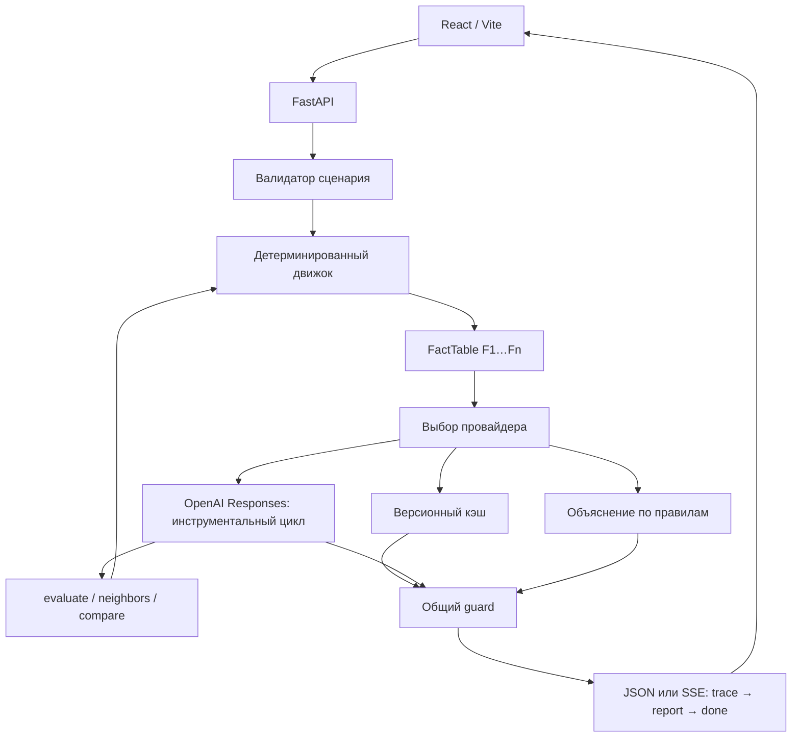

# Бэкенд «Аким на 5 часов»

Кратко для читателя README: архитектура приложения и таблица «что считает движок, что делает LLM» — в разделе «Архитектура приложения»; переменные окружения и режимы кэша — в разделе «Настройки»; запуск — «Запуск через venv» и «Docker и Compose»; итоговые проверки — «CI и приёмка B5». Разделы «B0…B4» — журнал разработки по этапам с историческими цифрами.

## Состояние B5

Ниже — журнал по этапам B0–B5 с историческими цифрами проверок; актуальные числа приёмки — в разделе «CI и приёмка B5» (298 backend / 143 web тестов на момент сдачи).

Реализован стартовый скелет на Python 3.14: конфигурация, `/api/health`,
CLI, pytest и Ruff. B1 добавляет детерминированный движок, валидатор,
атрибуцию Шепли, факты, поиск соседей и полное распределение сценариев.
B2 добавляет API сценариев, объяснения по правилам, golden и StaticFiles.
B3 добавляет structured-вызов OpenAI, общий guard и кэш с переходом к rules.
B4 добавляет цикл инструментов, живой SSE, demo-кэш и mini-eval.
B5 добавляет единый Docker-образ, Compose, CI и HTTP-проверку собранного приложения.

`backend/app/config.py` определяет корень через
`Path(__file__).resolve().parents[2]`. Каталоги данных и `.env` разрешаются
относительно корня, независимо от текущей рабочей папки. `.env` читается
через python-dotenv при импорте конфигурации; переменные процесса имеют приоритет.

Схемы ответов находятся только в `backend/app/engine/models.py` (pydantic v2).
В B1 определены `HealthResponse`, `Scenario`, `ValidationResult`, `EvalResult`,
`Fact`, `Neighbor` и их вложенные структуры.
Версия приложения — `0.1.0`. `data_hash` — первые 12 hex SHA-256 байтов
`districts.json`, `measures.json`, `rules.json` подряд в указанном порядке.
Хэш вычисляется при старте приложения, входные JSON не изменяются.

## Запуск через venv

Команды выполняются из корня клона. Активация окружения не нужна.
Перед запуском Python задайте `PYTHONUTF8=1`.

PowerShell (Windows, Python 3.14):

```powershell
$env:PYTHONUTF8='1'
py -3.14 -m venv .venv
.\.venv\Scripts\python.exe -m pip install -r backend/requirements.txt
.\.venv\Scripts\python.exe -c "import fastapi, pydantic, openai"
.\.venv\Scripts\python.exe -m pip check
Set-Location backend
..\.venv\Scripts\python.exe -m uvicorn app.main:app --host 127.0.0.1 --port 8000
```

Bash (Linux/macOS, установлен Python 3.14):

```bash
export PYTHONUTF8=1
python3.14 -m venv .venv
.venv/bin/python -m pip install -r backend/requirements.txt
.venv/bin/python -c 'import fastapi, pydantic, openai'
.venv/bin/python -m pip check
cd backend
../.venv/bin/python -m uvicorn app.main:app --host 127.0.0.1 --port 8000
```

В Git Bash используйте `py -3.14` для создания окружения и
`.venv/Scripts/python.exe` вместо `.venv/bin/python`.
Импорты завершаются с кодом 0, `pip check` печатает
`No broken requirements found.` Установка и запуск проверены на Windows
с CPython 3.14.7; проверка Linux/Docker относится к B5.

В другом терминале:

```powershell
Invoke-RestMethod http://localhost:8000/api/health
```

```bash
curl -fsS http://localhost:8000/api/health
```

Ожидается HTTP 200 и 9 полей: `status="ok"`, `provider="rules"`,
`ai_cache="first"`, `model=""`, `model_fast=""`, `has_key=false`,
`model_status="unchecked"`, `data_hash` (12 hex), `version="0.1.0"`.
Значения выше относятся к запуску без `.env` и без экспортированных AI-настроек.
Swagger доступен на `/docs`, схема FastAPI — на `/openapi.json` и
`/api/openapi.json` (последний путь используется `npm run gen:api`).

## Настройки

Все названия моделей задаются окружением. Названий моделей в коде нет.
Для запуска без ключа `.env` не требуется. Если нужен LLM, скопируйте
`.env.example` в `.env` (`Copy-Item .env.example .env` в PowerShell,
`cp .env.example .env` в bash) и заполните локально. Не перезаписывайте существующий
`.env`: ключ не должен попадать в git, вывод команд или описание PR.

| Переменная | По умолчанию | Назначение |
|---|---|---|
| `OPENAI_API_KEY` | пусто | Ключ; health сообщает только `has_key` |
| `OPENAI_MODEL` | пусто | Основная модель; пустое значение отключает живой LLM, demo-кэш доступен |
| `OPENAI_MODEL_FAST` | пусто | Быстрая модель для последующих этапов |
| `OPENAI_BASE_URL` | пусто | Пустое значение оставляет стандартный URL SDK |
| `AI_PROVIDER` | `auto` | `auto`, `llm`, `rules`; rules отключает проверку OpenAI |
| `AI_CACHE` | `first` | `first`: cache → llm → rules; `fallback`: llm → cache → rules; `0`: llm → rules |
| `MAX_TOOL_ROUNDS` | `6` | Положительный лимит раундов вызова инструментов |
| `ANALYZE_CONCURRENCY` | `2` | Максимум одновременно выполняющихся LLM-анализов |

Если выбрана LLM и заданы ключ и основная модель, lifespan проверяет
`AsyncOpenAI.models.list()` с таймаутом 120 с и `max_retries=1`.
`model_status="ok"` означает наличие ID в списке, `not_in_list` — отсутствие,
`unchecked` — отсутствие конфигурации или ошибку SDK. Ошибка списка не мешает
запуску; сырое сообщение SDK в лог не попадает. Генерация ответа при старте
не выполняется. Проверка списка может задержать готовность сервера на время
таймаута и одной повторной попытки.

## Проверки B0

Из корня клона, PowerShell:

```powershell
$env:PYTHONUTF8='1'
.\.venv\Scripts\python.exe -m pytest -q backend/tests
.\.venv\Scripts\python.exe -m ruff check backend
.\.venv\Scripts\python.exe -m ruff format --check backend
Set-Location backend
..\.venv\Scripts\python.exe -m pytest -q
..\.venv\Scripts\python.exe -m app.cli --version
```

Из корня клона, bash:

```bash
export PYTHONUTF8=1
.venv/bin/python -m pytest -q backend/tests
.venv/bin/python -m ruff check backend
.venv/bin/python -m ruff format --check backend
cd backend
../.venv/bin/python -m pytest -q
../.venv/bin/python -m app.cli --version
```

На этапе B0 ожидается: **12 passed** без сети из корня и из `backend/`,
Ruff check — `All checks passed!`, format check — `11 files already formatted`,
CLI печатает `0.1.0`. Маркер `slow` зарегистрирован; обычный pytest исключает
его, полный перебор B1 запускается явно через `python -m pytest -q -m slow`.
Команда `evaluate` и эталонные числа Score относятся к B1.

При приёмке B0 на Windows проверен живой uvicorn: `/api/health` и `/docs`
отвечают HTTP 200; health содержит 9 полей, `data_hash="1172683703cf"`,
`provider="rules"`, `has_key=false`, `model_status="unchecked"` без ключа.

После добавления ключа выполнена живая проверка B0:
`models.list()` вернул **128 моделей**, в том числе `gpt-4.1-mini`,
`gpt-5.4-mini`, `gpt-5.4-nano`, `gpt-5.5`, `gpt-6-sol` и `gpt-6-luna`.
Короткий `responses.create()` с `gpt-4.1-mini` вернул `completed` и `OK`
(12 входных и 2 выходных токена; фактический ID `gpt-4.1-mini-2025-04-14`).
При временном `OPENAI_MODEL=gpt-4.1-mini` живой health вернул HTTP 200,
`provider="llm"`, `has_key=true`, `model_status="ok"`.
Модель была задана только в окружении проверки: значения `OPENAI_MODEL`
и `OPENAI_MODEL_FAST` в локальном `.env` не менялись и пока пустые.
Список моделей подтверждает видимость ID; генерация проверена только на
указанной модели. Полный отчёт и его расход токенов проверяются в B3–B4.

Пустой `OPENAI_BASE_URL` из `.env.example` явно заменяется стандартным HTTPS
адресом при создании SDK-клиента: иначе SDK повторно считывает пустую переменную
окружения и запрос завершается `UnsupportedProtocol`.

Официальный Python SDK используется согласно
[документации OpenAI: список моделей](https://developers.openai.com/api/reference/python/resources/models/methods/list)
и [Responses API](https://developers.openai.com/api/reference/python/resources/responses/methods/create).

## Детерминированный движок B1

`catalog.py` загружает замороженные данные один раз; `validator.py` собирает
все семантические нарушения, прежде чем `scoring.evaluate` считает официальный
результат. `allow_partial=True` отключает только требование ровно пяти решений
для внутренних оценок; бюджет, конфликты и прочие ограничения сохраняются.
Структурно неверный JSON проверяет pydantic; CLI возвращает `BAD_REQUEST` и код 2.
HTTP-обработчик такой ошибки появляется в B2.

`scoring.py` суммирует эффекты с лагом и фиксированные синергии, затем применяет
clip к каждому из 50 показателей. Критическими считаются значения строго ниже 40.
Score вычисляется по формуле ТЗ без бонуса за остаток бюджета. Ответ содержит
компоненты формулы, районные индексы, критические пары и девять точек Q0–Q8.
`indicators_before`, `indicators_after`, `deltas` — словари из десяти пар
`код показателя → число`. В `critical_pairs.closed` остаётся исходное критическое
значение; исправленное значение доступно в `districts[id].indicators_after`.

Расчёты сохраняют точность до десяти десятичных знаков, CLI показывает Score
с тремя. Точная база **52.55768** отображается как **52.558**. Сравнение с
округлённой базой ошибочно дало бы 20024 набора хуже базы вместо **20003**.
`attribution.py` оценивает все 32 подмножества: сумма Шепли и waterfall равна
`score − baseline`; LOO — потеря при удалении меры, `per_unit = shapley / cost`.
Waterfall сортируется численно M1…M14. Для `scenario_id` сортировка строковая
по `measure_id`, затем району: M1, M10, …, M2; JSON имеет форму
`{"decisions":[...]}`, без пробелов, с явным `district:null` для городских мер.

`facts.py` строит F1…Fn только из движка и каталога: изменения показателей
(включая отрицательные), критические пары, вклады, лаги, назначения мер,
синергии, расходы и доли населения. Значения точные, текстовые числа имеют
два знака. Общегородские расходы показаны отдельно; они не приписываются
произвольно отдельным районам. Доля населения с закрытыми критическими парами
означает районы, где исправлен хотя бы один показатель.

`search.py` перебирает все валидные замены одного решения (мера и/или район),
убирает дубликаты и ранжирует по `score`, `zero_crit`, `min_district` или
`budget_cap`. Последняя цель по умолчанию ограничена текущими расходами.
Для `example_tz` найдено 117 соседей; лучший имеет Score **57.20556**, cost **100**.

`scripts/enumerate_plans.py` перебирает сочетания пяти мер и все назначения
районов; заранее вычисленные районные подмножества ускоряют точный перебор.
`data/plan_distribution.json` содержит **694395** сценариев, **20003** хуже
точной базы, минимум **52.0408375**, максимум **57.236735**, 1000 квантилей,
бины шириной 0.05 и top20. Дополнительные частоты точных Score обеспечивают
строгий перцентиль (доля оценок меньше, а не меньше или равных). Артефакт
проверяется по `data_hash` и `engine_version="1.0.0"`; без файла перцентиль
равен null, устаревший файл требует повторного перебора.

## Проверки B1

Из корня клона, PowerShell:

```powershell
$env:PYTHONUTF8='1'
.\.venv\Scripts\python.exe -m pytest -q backend/tests
.\.venv\Scripts\python.exe -m ruff check backend scripts
.\.venv\Scripts\python.exe -m ruff format --check backend scripts
.\.venv\Scripts\python.exe scripts/enumerate_plans.py
Set-Location backend
..\.venv\Scripts\python.exe -m pytest -q
..\.venv\Scripts\python.exe -m pytest -q -m slow
..\.venv\Scripts\python.exe -m app.cli evaluate ../data/scenarios/example_tz.json
..\.venv\Scripts\python.exe -m app.cli evaluate ../data/scenarios/example_tz.json --json
```

Bash:

```bash
export PYTHONUTF8=1
.venv/bin/python -m pytest -q backend/tests
.venv/bin/python -m ruff check backend scripts
.venv/bin/python -m ruff format --check backend scripts
.venv/bin/python scripts/enumerate_plans.py
cd backend
../.venv/bin/python -m pytest -q
../.venv/bin/python -m pytest -q -m slow
../.venv/bin/python -m app.cli evaluate ../data/scenarios/example_tz.json
../.venv/bin/python -m app.cli evaluate ../data/scenarios/example_tz.json --json
```

Ожидается **99 passed, 1 deselected** без сети и менее 10 секунд для обычного
набора; slow — **1 passed, 99 deselected**. Slow заново генерирует весь артефакт,
сравнивает его с сохранённым и сверяет выборку оптимизированных расчётов с
основным движком. Ruff check — `All checks passed!`, format — 24 файла.
CLI: `Score 56.543 | baseline 52.558 | delta +3.985`, `cost 95 | remaining 5 |
n_crit 0`, `percentile 99.918%`, `scenario_id efb979f1c9c1`.

Эталоны пяти валидных сценариев (Score округлён для показа):

| Сценарий | Score | Расходы | N_crit |
|---|---:|---:|---:|
| example_tz | 56.543 | 95 | 0 |
| cheapest | 55.667 | 61 | 1 |
| naive_esil | 54.009 | 100 | 2 |
| worst_of_all | 52.041 | 80 | 3 |
| optimum | 57.237 | 98 | 0 |

В B1 не реализованы HTTP API сценариев и анализ (B2–B4), golden (B2), Docker
и CI (B5). Открытых вопросов по B1 нет. Новых зависимостей не добавлено.

## API и объяснения B2

Маршруты `/api/config`, `/api/validate`, `/api/evaluate`, `/api/analyze` используют
единые pydantic-схемы из `engine/models.py`. Семантически неверный сценарий
получает HTTP 200 в validate и HTTP 422 в evaluate/analyze; Score для него
не считается. Ошибки структуры JSON и параметров запроса возвращают ту же
форму `{ok:false, violations:[...]}` с `BAD_REQUEST`. OpenAPI описывает эту форму
для всех трёх POST-эндпоинтов.

`config` передаёт пять районов, 14 мер, правила и компактное распределение
без 433010 внутренних частот Score. Его baseline **52.558** предназначен для
показа; `evaluate` возвращает точный результат **56.54307** для example_tz.
Критерий паритета с округлённым эталоном — `abs=5e-4`.

`analyze?provider=rules` строит факты, выбирает объяснения по шаблонам и
находит до трёх соседей с более высоким Score. Каждая рекомендация повторно
валидируется и оценивается движком: `verified=true`, `invalid_reason=null`.
Все утверждения ссылаются на существующие F-id. Для оптимума улучшений нет.
Отчёт явно различает критические показатели после мер, лаги, изменение
индексов и влияние на районы с соответствующей долей населения.

В B2 `provider=auto` тоже использует rules, независимо от настройки модели.
LLM-семафор создан при старте, rules его обходит. Загрузка распределения
происходит при старте; тёплый rules-вызов занимает примерно 13–46 мс локально.
`stream=1` отправляет серверные `trace`, затем полный `report` и `done`.
В B2 все шаги `kind="server"`; живой цикл инструментов добавляется в B4.
`verified_numbers` пока содержит нулевые счётчики; общий guard появляется в B3.

API и Swagger регистрируются перед StaticFiles. Если `web/dist` существует,
он обслуживается на `/`; иначе корень возвращает JSON-подсказку. CORS
разрешает dev-клиент `http://localhost:5173`.

`python -m app.cli golden` (из `backend`) создаёт `data/golden.json` с полями
`data_hash`, `engine_version`, `seed=42`, `cases`. В `cases` **71** запись:
17 пресетов, первые 1–4 решения example_tz с `allow_partial:true` и 50 уникальных
случайных валидных наборов. **59** имеют полный `eval`, **12** — `violations`
без оценки. Тест заново вычисляет весь файл и обнаруживает любые устаревшие
поля. Числа не округляются до отображаемых трёх знаков.

## Проверки B2

Из корня клона, PowerShell:

```powershell
$env:PYTHONUTF8='1'
.\.venv\Scripts\python.exe -m pytest -q backend/tests
.\.venv\Scripts\python.exe -m ruff check backend scripts
.\.venv\Scripts\python.exe -m ruff format --check backend scripts
Set-Location backend
..\.venv\Scripts\python.exe -m app.cli golden
$env:AI_PROVIDER='rules'
..\.venv\Scripts\python.exe -m uvicorn app.main:app --host 127.0.0.1 --port 8000
```

Bash:

```bash
export PYTHONUTF8=1
.venv/bin/python -m pytest -q backend/tests
.venv/bin/python -m ruff check backend scripts
.venv/bin/python -m ruff format --check backend scripts
cd backend
../.venv/bin/python -m app.cli golden
AI_PROVIDER=rules ../.venv/bin/python -m uvicorn app.main:app --host 127.0.0.1 --port 8000
```

Ожидается **139 passed, 1 deselected** (локально около 7.4 с), Ruff без
замечаний, **30** отформатированных Python-файлов. CLI golden печатает
71 cases, 59 valid, 12 invalid; повторная генерация не меняет файл.

В другом терминале из корня клона (PowerShell; в bash заменить `curl.exe` на `curl`):

```powershell
curl.exe -fsS http://localhost:8000/api/config
curl.exe -fsS http://localhost:8000/docs
curl.exe -fsS -H 'Content-Type: application/json' --data-binary '@data/scenarios/example_tz.json' http://localhost:8000/api/evaluate
curl.exe -fsS -H 'Content-Type: application/json' --data-binary '@data/scenarios/example_tz.json' 'http://localhost:8000/api/analyze?provider=rules'
curl.exe -fsS -N -H 'Content-Type: application/json' --data-binary '@data/scenarios/example_tz.json' 'http://localhost:8000/api/analyze?provider=rules&stream=1'
curl.exe -sS -i -H 'Content-Type: application/json' --data-binary '@data/scenarios/invalid_budget.json' http://localhost:8000/api/evaluate
```

Первые запросы возвращают HTTP 200: evaluate — Score **56.54307**, cost **95**,
N_crit **0**; analyze — `provider="rules"`, три проверенные рекомендации;
поток — `trace → report → done`. Последний запрос возвращает HTTP **422**
и `BUDGET_EXCEEDED` с превышением на **29** у.е. Эти проверки выполнены
на живом uvicorn (порт 8001) через curl; `/docs` также HTTP 200.

В B2 не добавлены LLM/guard/кэш (B3–B4), Docker/CI (B5) и опциональное
сохранение сценариев. Новых зависимостей и открытых вопросов по B2 нет.

## Провайдеры и guard B3

`api/routes.py` вызывает асинхронный `ai/service.py`. Валидация и подготовка
фактов всегда предшествуют выбору провайдера. CPU-расчёты и файловый кэш
исполняются в thread pool; сетевые вызовы используют AsyncOpenAI и не блокируют
event loop. Настроены таймаут 120 секунд и одна повторная попытка SDK.

| Условие | Порядок |
|---|---|
| `?provider=rules` или `AI_PROVIDER=rules` | rules, без кэша и семафора |
| `AI_CACHE=first` | cache → llm → rules |
| `AI_CACHE=fallback` | llm → cache → rules |
| `AI_CACHE=0` | llm → rules, без чтения/записи кэша |
| Нет ключа или модели | звено llm пропускается |

Занятый семафор не создаёт очередь ожидания: следующий провайдер вызывается
сразу. Rate limit, timeout, connection/API error, incomplete, refusal и ошибка
разбора не превращаются в HTTP 5xx. Возврат к rules помечается, например,
`rules(fallback:timeout)`; сырое сообщение исключения и ключ не попадают в ответ.

`OpenAIClient.structured_call` вызывает `responses.parse(text_format=AnalysisReport,
temperature=0)` с лимитом ответа 16000 токенов. Имена моделей берутся только
из окружения. `build_prompts` передаёт каталог, правила и профили в system,
FactTable — в user; произвольные поля HTTP-запроса в промпт не попадают.
`PROMPT_VERSION="1.0.0"`. Сервер задаёт provider/model/trace и счётчики проверки;
модель не может подделать журнал исполненных инструментов. Строгая схема
генерации допускает только пустой объект trace.input; выходная HTTP-схема
сохраняет реальные параметры серверных шагов.

Каждый полученный отчёт — llm, cache или rules — проходит `guard_report`:

- Каждая рекомендация заново валидируется и оценивается. Score/delta/cost
  перезаписываются; невалидная получает нулевые числа, `verified=false` и причину.
- Неизвестные F-id удаляются из evidence, само утверждение сохраняется.
- Десятичные числа в пользовательском тексте сверяются с фактами, константами
  ТЗ, доверенными результатами инструментов и свежими оценками рекомендаций.
  Допуск ±0.005; поддержаны точка, запятая и варианты знака минус. Целые числа,
  идентификаторы и метаданные не проверяются этим счётчиком. Более двух знаков
  после запятой помечаются целиком как неподтверждённый формат, без усечения.
  Счётчики считают вхождения; список unverified содержит уникальные токены.

Guard проверяет происхождение чисел, а не смысл утверждения или связь числа
с конкретным показателем. Неподтверждённый текст не блокирует выдачу отчёта.
Это ограничение важно учитывать при оценке качества объяснений.

`ReportCache` пишет атомарно в `data/cache/runtime/<sha256>.json`. Ключ получен
из канонического сценария, модели и версии промпта; metadata также проверяет
data_hash, engine_version и scenario_id. Повреждённые, устаревшие и недоступные
файлы дают промах кэша. Для офлайн-демо поддерживается тот же envelope в
`data/cache/demo/<scenario_id>.json`: если модель не настроена, допускается
модель сохранённого отчёта. Настоящие demo-ответы генерируются в B4.

Реализация сверена с установленным SDK 3.19.0 и
[официальной документацией Structured Outputs](https://developers.openai.com/api/docs/guides/structured-outputs).

## Проверки B3

Из корня, PowerShell:

```powershell
$env:PYTHONUTF8='1'
.\.venv\Scripts\python.exe -m pytest -q backend/tests
.\.venv\Scripts\python.exe -m ruff check backend scripts
.\.venv\Scripts\python.exe -m ruff format --check backend scripts
```

Bash:

```bash
export PYTHONUTF8=1
.venv/bin/python -m pytest -q backend/tests
.venv/bin/python -m ruff check backend scripts
.venv/bin/python -m ruff format --check backend scripts
```

Ожидается **213 passed, 1 deselected** (локально около 8 с), Ruff без ошибок,
**39** файлов отформатированы. Тест с ложным Score **99** и evidence **F999**
получает число движка и очищенный evidence. Проверяются все порядки провайдеров,
повреждённый кэш, занятый семафор, ошибки SDK и отсутствие утечки секретов.

Для живой проверки нужны локальные `OPENAI_API_KEY` и `OPENAI_MODEL`;
`AI_CACHE=0` гарантирует новый вызов. Запустите uvicorn как выше, затем:

```powershell
curl.exe -fsS http://localhost:8000/api/health
curl.exe -fsS -H 'Content-Type: application/json' --data-binary '@data/scenarios/example_tz.json' http://localhost:8000/api/analyze
```

В bash используйте `curl`. В выполненной проверке временно выбранная через env
`gpt-4.1-mini` дала health `provider=llm, model_status=ok`; analyze — HTTP **200**,
`provider=llm`, **17/17** подтверждённых десятичных чисел. Фактическая модель
`gpt-4.1-mini-2025-04-14`, расход **8354** входных и **1291** выходной токен.
Среди трёх альтернатив были невалидные: guard сохранил их с `verified=false`
и причиной. B3 не выдаёт их за проверенные; предварительная проверка моделью
через инструменты добавляется в B4. Без ключа/модели и demo-кэша — HTTP 200,
`provider=rules`. Постоянные имена моделей в код не добавлены.

Не сделано в B3: tool-loop, живые agent-trace и прогрев demo/mini-eval (B4),
Docker/CI (B5). Новых зависимостей нет. Вопрос о постоянном выборе модели
открыт; он не блокирует работу с временной настройкой окружения.

## Агент, SSE и mini-eval B4

`agent.py` исполняет ручной цикл Responses API. Первый `responses.create`
требует вызов инструмента; дальнейшие раунды используют `auto`. Все output items,
включая reasoning и идентификаторы вызовов, сохраняются в следующем input.
`function_call_output.output` всегда строка JSON, а не объект. Ошибка инструмента
возвращается как `{"error":...}` и позволяет модели исправить запрос.

| Инструмент | Аргументы | Результат движка |
|---|---|---|
| evaluate_scenario | decisions | Компактная оценка или violations без Score |
| best_neighbors | decisions, objective, k | До k валидных замен одного решения |
| compare_scenarios | a и b в форме Scenario | Две оценки и разницы b − a |

Схемы `strict:true`, все поля обязательны, дополнительные поля запрещены.
ID районов и мер берутся из каталога; для городских мер district=null.
`k` ограничен 1…10; цели поиска — score, zero_crit, min_district, budget_cap.
Поиск может вернуть соседа хуже исходного: модель должна отобрать улучшения,
используя предоставленные числа, а не рассчитывая их самостоятельно.

`MAX_TOOL_ROUNDS` ограничивает число раундов create. После исчерпания лимита
сервер добавляет trace `agent_round_limit`; последний `responses.parse` получает
`text_format=AnalysisReport`, те же инструменты и `tool_choice="none"`.
Если черновик содержит невалидные либо не улучшающие Score рекомендации или менее 90% утверждений
со ссылками на факты, разрешён один дополнительный structured-вызов исправления.
Сервер передаёт ему полные допустимые альтернативы из движка; модель должна
скопировать выбранный набор целиком. Действия отмечаются серверными шагами
best_neighbors и revise_report. Затем общий guard всё равно проверяет ответ;
бесконечного цикла повторов нет. При отсутствии улучшений recommendations
должен быть пустым. Повторная неулучшающая рекомендация вызывает штатный fallback.
Счётчик токенов в серверном trace суммирует ответы create и parse.
Название модели берётся из env; отдельный путь structured_call сохранён.

`trace.kind="agent"` появляется только при исполнении выбранного моделью
инструмента сервером. Входы, длительность и результат исполнения формируются
сервером; модель не заполняет этот журнал. Guard использует фактические
результаты инструментов. Для кэшированного отчёта сервер заново исполняет
сохранённые входы инструментов, чтобы получить доверенные числа для guard.
Числа из произвольного текста trace не являются доказательством.

SSE теперь отправляет шаг сразу после завершения, пока модель продолжает
работу. Порядок: `trace` по одному, полный `report` после guard, затем `done`.
Валидация сценария происходит до HTTP-заголовков; невалидный stream-запрос
по-прежнему возвращает 422. Закрытие клиентом потока отменяет задачу и
освобождает семафор. NaN/Infinity в аргументах инструмента отклоняются до trace.

`PROMPT_VERSION="2.2.0"` требует исходы критических S1/S2 Нуры, выбранные
длинные лаги M3/M13 и рекомендации из результатов инструментов. Целевой объём
220 слов; pydantic проверяет жёсткий предел 300 слов на все текстовые поля.
Слишком длинный ответ LLM вызывает обычный fallback, а не HTTP 5xx.

`scripts/ai_eval.py` проверяет пять валидных пресетов (среди них есть M3 и M13).
JSONL содержит версии, сценарий, факты, отчёт, trace и результаты проверок:
все рекомендации валидны и численно точны, ≥90% утверждений имеют существующие
evidence, все разделы непусты, десятичные числа подтверждены, Нура и длинные
лаги упомянуты, объём ≤300 слов, у llm/cache есть исполнимый agent tool step.
Mini-eval независимо повторяет расчёты и проверку чисел; старым счётчикам
из отчёта он не доверяет. Неуспешный запуск завершается с кодом 1.

`--warm-demo` принудительно использует живой llm без чтения кэша. Только
прошедший все проверки живой отчёт атомарно публикуется в
`data/cache/demo/<scenario_id>.json`; fallback не выдаётся за ответ модели.
Сохранённые отчёты можно показывать без ключа с `AI_PROVIDER=auto, AI_CACHE=first`
и пустыми моделью/ключом. Для чистого rules используйте `?provider=rules`.

## Проверки B4

PowerShell, из корня:

```powershell
$env:PYTHONUTF8='1'
.\.venv\Scripts\python.exe -m pytest -q backend/tests
.\.venv\Scripts\python.exe -m ruff check backend scripts
.\.venv\Scripts\python.exe -m ruff format --check backend scripts
.\.venv\Scripts\python.exe scripts/ai_eval.py --provider rules --output data/cache/eval/rules.jsonl
.\.venv\Scripts\python.exe scripts/ai_eval.py --warm-demo --output data/cache/eval/live.jsonl
```

Bash:

```bash
export PYTHONUTF8=1
.venv/bin/python -m pytest -q backend/tests
.venv/bin/python -m ruff check backend scripts
.venv/bin/python -m ruff format --check backend scripts
.venv/bin/python scripts/ai_eval.py --provider rules --output data/cache/eval/rules.jsonl
.venv/bin/python scripts/ai_eval.py --warm-demo --output data/cache/eval/live.jsonl
```

Последняя команда требует настроенные ключ и модель и расходует API-токены.
Ожидается **291 passed, 1 deselected**, Ruff без замечаний, **47** файлов;
mini-eval — **5/5 PASS** для rules и живых отчётов. Для SSE используйте curl
из раздела B2: события trace теперь приходят до завершения моделью отчёта.

В B4 не входят Docker/CI (B5) и опции после B5. Новых зависимостей нет.

Фактический прогон 23.09.2026: **5/5** живых отчётов, **49/49** утверждений
с существующими evidence, **45/45** десятичных чисел подтверждены,
**10/10** рекомендаций валидны, пересчитаны движком и строго улучшают Score.
Объём отчётов — **69–198** слов. Для optimum recommendations пустым массивом:
сервер и mini-eval отдельно проверяют улучшение, не доверяя числам модели.
Guard не является семантической проверкой каждого слова.
Все пять ответов сохранены вместе с настоящими agent-trace.
Повторный mini-eval с пустыми ключом и моделью дал **5/5 provider=cache**;
отдельный rules-прогон — **5/5**. Результаты: `live.jsonl`, `offline.jsonl`,
`rules.jsonl` в `data/cache/eval/`.

## Архитектура приложения



`POST /api/analyze` сначала проверяет структуру и все ограничения. Невалидный
сценарий получает 422 до SSE-заголовков. Для валидного сценария сервер считает
оценку, строит факты и выбирает провайдера. Кэш привязан к сценарию, модели,
версии промпта, движка и данных. При cache miss модель получает только факты
и фиксированный каталог; результаты инструментов формирует Python-движок.
Занятый семафор сразу включает fallback. Полный участок работы LLM, включая
единственную коррекцию, ограничен 120 секундами: после timeout сервер ещё
успевает вернуть кэш или rules до клиентского ограничения в 130 секунд.
Каждый завершённый шаг отправляется в SSE; финальный отчёт выходит после guard.
Отключение клиента отменяет задачу и освобождает семафор.

| Что вычисляет движок / сервер | Что делает LLM |
|---|---|
| Допустимость, бюджет, направления, конфликты | Объясняет достоинства, риски и компромиссы |
| Эффекты, лаги, clip, синергии, Score, критичность | Выбирает инструменты для проверки альтернатив |
| Шепли, LOO, таймлайн, перцентиль | Описывает последствия для жителей |
| Числа альтернатив и проверка улучшения | Ссылается на F-id; возвращает структурированный текст |
| Повторная проверка рекомендаций и десятичных чисел | Не является источником расчётов и не задаёт server trace |

## Docker и Compose

`Dockerfile` сначала собирает фронтенд на `node:24-alpine`, сохраняя соседство
`web/` и `data/`. Без `web/package.json` этот шаг пропускается. Финальный образ
`python:3.14-slim` содержит приложение, данные, пять demo-отчётов и `web/dist`.
Корневой `.env` и runtime-кэш не копируются в образ. Uvicorn слушает порт 8000,
healthcheck использует Python stdlib. Compose подставляет `.env` и подключает
`./data/cache:/app/data/cache`, сохраняя ответы между перезапусками.

PowerShell, из корня клона:

```powershell
if (-not (Test-Path .env)) { Copy-Item .env.example .env }
docker compose config --quiet
docker compose up --build -d --wait
Invoke-RestMethod http://localhost:8000/api/health
$env:PYTHONUTF8='1'
py -3.14 scripts/container_smoke.py
# После демонстрации:
docker compose down
```

Bash:

```bash
test -f .env || cp .env.example .env
docker compose config --quiet
docker compose up --build -d --wait
curl -fsS http://localhost:8000/api/health
PYTHONUTF8=1 python3.14 scripts/container_smoke.py
# После демонстрации:
docker compose down
```

Smoke-команда предназначена для чистой конфигурации без ключа, как в CI.
Обычный `/api/health` при настроенном ключе может сообщать `provider=llm`.
Интерфейс доступен на `http://localhost:8000/`; если `index.html` ещё не собран,
корень возвращает JSON-подсказку, в том числе при наличии пустого `web/dist`.
API и Swagger регистрируются перед StaticFiles и остаются доступны.
HTML отдаётся с `Cache-Control: no-cache`, включая условные ответы 304:
после пересборки браузер перевалидирует index и получает актуальные имена
динамических JS-модулей. Уже открытый экран после смены сборки нужно обновить.
Путь через venv выше работает без Docker. Для совместного локального запуска
сначала выполните `npm ci` и `npm run build` из `web`, затем запустите uvicorn.

## CI и приёмка B5

`.github/workflows/ci.yml` запускается на push и pull_request. Python 3.14
проверяет pytest без slow, Ruff lint и форматирование; Node 24 выполняет
`npm ci`, `npm test`, `npm run build`, если есть фронтенд. После этих проверок
отдельный Linux job собирает и запускает Compose и выполняет HTTP smoke.
CI не содержит API-ключей и не обращается к LLM. Настройка actions сверена с
официальными [checkout](https://github.com/actions/checkout),
[setup-python](https://github.com/actions/setup-python) и
[setup-node](https://github.com/actions/setup-node).

HTTP smoke проверяет health, конфигурацию **5 районов / 14 мер**,
распределение **694395 / 20003**, оценку example **56.543 / 95 / 0**, ошибки 422,
rules, порядок событий SSE, доступность HTML и **5/5** demo из кэша без ключа.
Frontend-тесты на текущем main: **143 passed**, сборка TypeScript/Vite успешна.
Backend B5: **298 passed, 1 deselected**, Ruff check и format — без замечаний,
**49** файлов. Команды из корня клона: `python -m pytest -q backend/tests`,
`python -m ruff check backend scripts`, `python -m ruff format --check backend scripts`.
Используйте Python из venv и задайте `PYTHONUTF8=1`, как в командах выше.
Полный перебор остаётся отдельной явной проверкой:

```powershell
$env:PYTHONUTF8='1'
.\.venv\Scripts\python.exe -m pytest -q backend/tests -m slow
```

```bash
PYTHONUTF8=1 .venv/bin/python -m pytest -q backend/tests -m slow
```

Ожидается один slow-тест с теми же **694395** валидными наборами,
**20003** ниже базы и максимумом **57.236735**. SQLite, shocks/events и stress
не входят в B0–B5 и не начаты из-за ограничения времени.

Фактическая проверка чистого клона на Windows 23.09.2026: новый `git clone`,
новый venv CPython 3.14.7, установка всех пинов, `pip check`, **298** тестов
и Ruff прошли. Uvicorn из клона без `.env` вернул health **200**, JSON-подсказку
для несобранного интерфейса, OpenAPI по обоим путям и настоящий demo-отчёт
`provider=cache` без ключа. Рабочий клон дополнительно прошёл весь HTTP smoke
со статикой, SSE и пятью demo.

Первый [запуск CI](https://github.com/BAITC-Hacks/hack-b5f2d710-lowtap/actions/runs/35854440853)
не получил runners: GitHub сообщил блокировку аккаунта из-за billing.
Это не результат выполнения тестов; локальные проверки не выдаются за зелёный CI.
Владельцу организации нужно устранить блокировку и повторить запуск workflow.

Локальный Docker был восстановлен пользователем после ошибки старого runtime
socket. Затем на Linux Engine **29.8.0** выполнены настоящие `compose build`,
`compose up -d --wait --wait-timeout 90` и полный HTTP smoke — успешно.
Дополнительные одноразовые Linux-контейнеры дали **298 passed, 1 deselected**
для backend (финальный прогон 7.92 с) и **142 passed** для frontend (после финального теста валидатора на main — 143) (1.24 с).
После обновления карты в `33e958a` повторены сборка и Linux frontend-тесты.
HTML-проверка подтвердила `no-cache` и одинаковый ETag в ответах 200/304.
Проверка запускалась
с отдельным Compose project и пустыми AI-переменными в локальном override;
исходный `.env` не перезаписывался, уже работавшие Supabase-контейнеры не затронуты.
Браузерная проверка подтвердила интерфейс, example **56.54 / 95**, ответ
`cache` с моделью `gpt-4.1-mini`, настоящий agent trace и **10/10** чисел.
Таким образом контейнерная приёмка пройдена локально; ограничение GitHub
Actions по billing остаётся отдельным внешним вопросом.

Для локального запуска с добавленным пользователем ключом пустой
`OPENAI_MODEL` в игнорируемом `.env` заполнен проверенным `gpt-4.1-mini`.
Ключ не изменялся и не выводился. Это локальная настройка, а не дефолт кода:
чистый клон по-прежнему работает через demo-кэш/rules без секретов.
